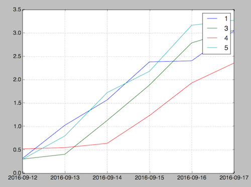

# Dataframe
[](https://travis-ci.org/JordiPolo/dataframe)

DataFrame is a library that implements an API similar to [Python's Pandas](http://pandas.pydata.org/) or [R's data.frame()](http://www.r-tutor.com/r-introduction/data-frame).

## Installation

Add `dataframe` to your list of dependencies in `mix.exs`:

```
def deps do
  [{:dataframe, "~> 0.1.0"}]
end
```


## Usage

### Tutorials

- [Lesson 1](tutorial/lesson1.md)


### Creation
```elixir
data = DataFrame.new(DataFrame.Table.build_random(6,4), [1,3,4,5], DataFrame.DateRange.new("2016-09-12", 6))
```

output:
```
              1             3             4             5
2016-09-12    0.3216495192  0.3061978162  0.5240627861  0.3014870998
2016-09-13    0.7085624128  0.1027917034  0.0274851281  0.4999253931
2016-09-14    0.5409299230  0.7234486655  0.0902951353  0.9265397862
2016-09-15    0.8144437609  0.7566869039  0.5943981962  0.4555049347
2016-09-16    0.0228473208  0.9033617026  0.6984988237  0.9858222366
2016-09-17    0.6401066584  0.2700256640  0.4256911712  0.1085587668
```

### Exploring
```elixir
DataFrame.head(data, 2)
```
```
              1             3             4             5
2016-09-12    0.3216495192  0.3061978162  0.5240627861  0.3014870998
2016-09-13    0.7085624128  0.1027917034  0.0274851281  0.4999253931
```

```elixir
DataFrame.tail(data, 1)
```
```
              1             3             4             5
2016-09-17    0.6401066584  0.2700256640  0.4256911712  0.1085587668
```

```elixir
DataFrame.describe(data)
```
```
              1             3             4             5
count         6             6             6             6
mean          0.6465539263  0.5159964091  0.3872831261  0.3932447202
std           0.1529956837  0.3280592207  0.1795171140  0.3121805879
min           0.4016542004  0.0206350637  0.0337014209  0.0177659020
25%           0.6282734986  0.5048574951  0.3799407685  0.2747983874
50%           0.7006870983  0.6401629955  0.4141661547  0.4043847826
75%           0.7412280866  0.6620905719  0.4517382532  0.4916518963
max           0.8024114094  0.9682031054  0.6199458675  0.8934404147
```

### Transposing

```elixir
DataFrame.transpose(data)
```
```
              2016-09-12    2016-09-13    2016-09-14    2016-09-15    2016-09-16    2016-09-17
1             0.3216495192  0.7085624128  0.5409299230  0.8144437609  0.0228473208  0.6401066584
3             0.3061978162  0.1027917034  0.7234486655  0.7566869039  0.9033617026  0.2700256640
4             0.5240627861  0.0274851281  0.0902951353  0.5943981962  0.6984988237  0.4256911712
5             0.3014870998  0.4999253931  0.9265397862  0.4555049347  0.9858222366  0.1085587668
```

### Sorting

Sorting index (defaults bigger to smaller)
```elixir
DataFrame.sort_index(data)
```
```
              1             3             4             5
2016-09-17    0.6401066584  0.2700256640  0.4256911712  0.1085587668
2016-09-16    0.0228473208  0.9033617026  0.6984988237  0.9858222366
2016-09-15    0.8144437609  0.7566869039  0.5943981962  0.4555049347
2016-09-14    0.5409299230  0.7234486655  0.0902951353  0.9265397862
2016-09-13    0.7085624128  0.1027917034  0.0274851281  0.4999253931
2016-09-12    0.3216495192  0.3061978162  0.5240627861  0.3014870998
```

Sorting by a column (false to sort smaller to bigger)
```elixir
DataFrame.sort_values(data, 4, false)
```
```
              1             3             4             5
2016-09-13    0.7085624128  0.1027917034  0.0274851281  0.4999253931
2016-09-14    0.5409299230  0.7234486655  0.0902951353  0.9265397862
2016-09-17    0.6401066584  0.2700256640  0.4256911712  0.1085587668
2016-09-12    0.3216495192  0.3061978162  0.5240627861  0.3014870998
2016-09-15    0.8144437609  0.7566869039  0.5943981962  0.4555049347
2016-09-16    0.0228473208  0.9033617026  0.6984988237  0.9858222366
```

### Selecting

By name:
```elixir
DataFrame.loc(data, DataFrame.DateRange.new("2016-09-15", 2), [3,4])
```
```
              3             4
2016-09-15    0.5417848216  0.5546980818
2016-09-16    0.6621771048  0.5763923325
```

A specific data by name:
```elixir
DataFrame.at(data, "2016-09-15", 4)
```
```
0.5546980818725673
```


By position:
```elixir
DataFrame.iloc(data, 4..6, 2..4)
```
```
              4             5
2016-09-16    0.6984988237  0.9858222366
2016-09-17    0.4256911712  0.1085587668
```

```elixir
DataFrame.iat(data, 0, 0)
```
```
0.31553155828919915
```

The library is in very early stages of development. No effort has been made to optimize its performance. Expect it to be slow.

### Plotting

If you have Python and Matplotlib you can plot the data in your Dataframe.
Check out the [Explot](https://github.com/JordiPolo/explot) package for installation details.

Let's plot the cummulative sum of the values:

```
 data |> DataFrame.cumsum |> DataFrame.plot
```

Will give us this graph:



## Development

Run tests
```
mix test
```

## TODO

- Deal with exceptions (negative numbers as input, etc.)
- Setting of subtable data
- Types of columns (no stat data on text, etc)
